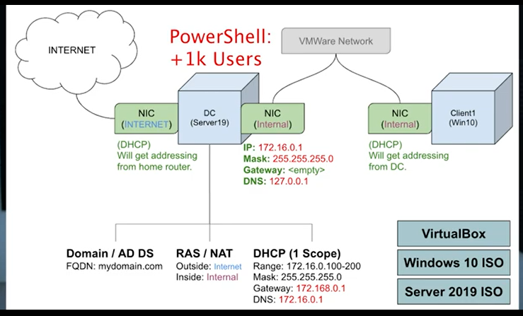

# Active Directory Setup and users onboarding Lab Project
#### In this lab, I setup an active directory network and onboarded users
## Architecture

### Objective
- Environments Preparation
- Setup Domain Control/AD Server
- Create/Onboard 1000k Users in AD
- Setup and login via another Windows 10 VM

### Environments and Technologies Used:

- VMware Workstation Player
- Oracle VirtualBox
- MS Windows 10 ISO
- MS Server 2019 ISO

<b>

### Environments Preparation
- Download and Install Windows 10 VM
- Download and Install Windows Server 2019 as a Domain Controler

### Setup Domain Control on Window Server 2019
- Setup Active Directory Server
- RAS/NAT Setup
- DHCP Setup

### Create/Onboard 1000k Users in AD

### Setup and login via another Windows 10 VM